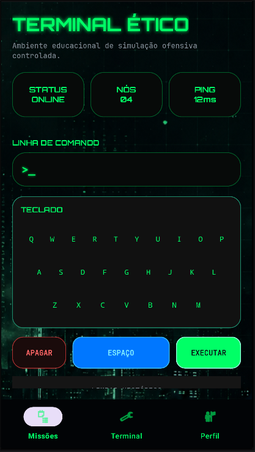
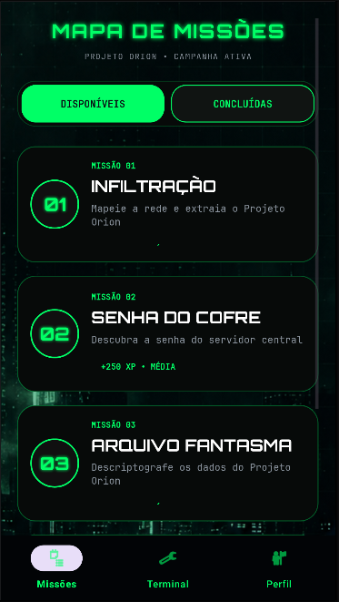
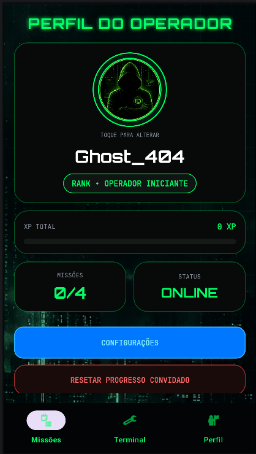

<div align="center">

# 🟢 DARKNET PROTOCOL

### _Simulação educacional cyberpunk focada em lógica, terminal e desafios de segurança ofensiva controlada._

<br>


</div>

---

# 📌 SOBRE O PROJETO

O **Darknet Protocol** é um aplicativo Android com temática hacker/cyberpunk desenvolvido para fins educacionais.

O projeto simula operações ofensivas controladas em um ambiente inspirado em:
- terminais futuristas
- sistemas de invasão simulados
- interfaces cyberpunk
- desafios de lógica e segurança

O objetivo é ensinar conceitos básicos de:
- lógica computacional
- terminal e comandos
- descriptografia
- análise de redes
- progressão de jogador
- persistência de dados
- experiência visual interativa

Porque aprender segurança ofensiva em slide branco do PowerPoint deveria violar convenções internacionais.

---

# 📸 PREVIEW

## 🖥️ TERMINAL

<p align="center">
  
</p>

---

## 🎯 MISSÕES

<p align="center">
  
</p>

---

## 👤 PERFIL

<p align="center">
  
</p>

---

# ⚡ FUNCIONALIDADES

## 🎯 Sistema de Missões
- Missões progressivas
- Briefings interativos
- Sistema de XP
- Progressão de rank
- Salvamento local
- Sincronização em nuvem

---

## 💻 Terminal Interativo
- Digitação via teclado virtual
- Execução de comandos simulados
- Histórico de terminal
- Feedback visual em tempo real

### Comandos disponíveis

```bash
HELP
SCAN
PROXY
BYPASS
EXTRACT
CLEAR
STATUS
PING
```

---

## 👤 Perfil do Operador
- Alteração de nickname
- Alteração de foto de perfil
- Sistema de conquistas
- Barra de XP
- Rank dinâmico

---

## ⚙️ Configurações
- Sincronização Firebase
- Reset de progresso
- Controle de som
- Vibração
- Preferências visuais

---

# 🧩 MISSÕES ATUAIS

## 🟢 MISSÃO 01 — INVASÃO À REDE

Sequência correta:

```txt
SCAN → PROXY → BYPASS → EXTRACT
```

---

## 🟡 MISSÃO 02 — QUEBRA DE SENHA

Descubra a senha utilizando pistas fornecidas pelo terminal.

---

## 🔵 MISSÃO 03 — ARQUIVO FANTASMA

Descriptografe arquivos usando Cifra de César.

---

## 🔴 MISSÃO 04 — NÓ INVASOR

Identifique o IP suspeito fora da rede local.

---

# 🛠️ TECNOLOGIAS UTILIZADAS

| Tecnologia | Uso |
|---|---|
| Java | Desenvolvimento principal |
| Android Studio | IDE |
| Firebase Auth | Login |
| Firebase Firestore | Banco de dados |
| Material Design | Interface |
| Glide | Carregamento de imagens |
| CircleImageView | Avatar circular |

---

# 📂 ESTRUTURA DO PROJETO

```txt
com.darknetprotocol
│
├── activities
│   ├── MainActivity
│   ├── MissionsActivity
│   ├── TerminalActivity
│   ├── ProfileActivity
│   ├── SettingsActivity
│   ├── PasswordMissionActivity
│   ├── DecryptMissionActivity
│   └── IpMissionActivity
│
├── utils
│   ├── PlayerPrefs
│   ├── CloudSaveManager
│   └── SoundManager
│
└── res
    ├── drawable
    ├── layout
    ├── menu
    ├── anim
    └── values
```

---

# 🔥 FIREBASE

O projeto utiliza:

- Firebase Authentication
- Firebase Firestore

## Configuração

1. Crie um projeto no Firebase
2. Adicione um aplicativo Android
3. Baixe o arquivo:

```txt
google-services.json
```

4. Coloque em:

```txt
app/google-services.json
```

Porque Android sem Firebase hoje em dia é praticamente um Tamagotchi glorificado.

---

# 🚀 COMO EXECUTAR

Clone o projeto:

```bash
git clone https://github.com/Faculdade-Projeto-Darknet/Darknet-Projeto.git
```

Abra no Android Studio e execute:

```bash
.\gradlew.bat assembleDebug
```

Ou rode diretamente pelo Android Studio.

---

# 🧠 ROADMAP

## Futuras implementações

- Sistema completo de login
- Loja de skins
- Mais missões
- Ranking online
- Sistema de inventário
- Sons ambientes
- Animações avançadas
- Sistema de badges
- Novos terminais
- Multiplayer cooperativo

---

# 👨‍💻 AUTORES

<div align="center">

## Desenvolvido por

### David Rodrigues  
### Felipe Gabriel  
### Alex Ferreira  
### Tiago Renato  

</div>

---

# 📜 LICENÇA

Projeto acadêmico e educacional.

Uso destinado exclusivamente para fins de aprendizado.

---

<div align="center">

# 🟢 DARKNET PROTOCOL

```txt
> ACCESS GRANTED
> SYSTEM ONLINE
> READY FOR NEXT OPERATION
```

</div>
